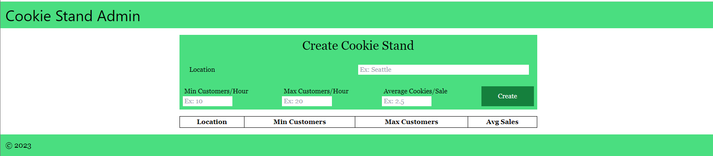

# LAB - Class 37

## Project: Cookie Stand Admin

## Author: Harper Foley

### Links and Resources

* [NextJS](https://nextjs.org/docs/getting-started)
* [React](https://reactjs.org/docs/getting-started.html)
* [TailwindCSS](https://tailwindcss.com/docs/installation)

### Setup

* Clone repo from GitHub
  * `gh repo clone hfoley2013/cookie-stand-admin`
* Install Node.js and npm
  * If you do not already have Node.js and npm on your machine, you will need to install it.
  * This can be done by following the instructions on the official [Node.js website](https://nodejs.org/en/docs/).
* Install dependencies
  * Navigate to the root directory of the repository on your machine and run `npm install` in the terminal.
  * This will download and install all of the dependencies listed in the package.json file.
* Start the application
  * You can now run `npm run dev` in the terminal to start the Next.js application in development mode.
* Verify the application
  * Open a web browser and visit `http://localhost:3000` to verify that the application is running properly.
  * You should see the following in your window.

  

### File Structure

* `./pages/index.js` is the main file for the repository.
* All components rendered in `index.js` are imported from the `./pages/components` directory.
  * The `components` directory contains the following:
    * `Header`
    * `Footer`
    * `CookieStandForm`
    * `ReportTable`
* All components are created in their respective `.js` files and then imported into the `index.js` file for rendering and display to the user.
